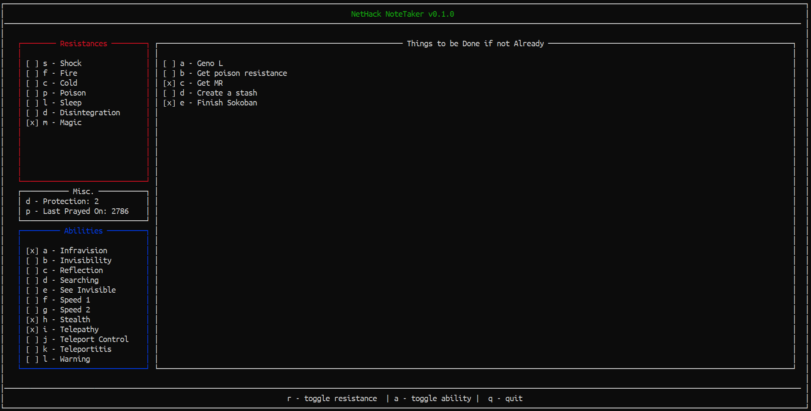

<h1 align="center">
  Nethack NoteTaker
</h1>

<h4 align="center">A terminal based note taking application for the game <a href="https://www.nethack.org/" target="_blank">Nethack</a>.</h4>

  <a href="#key-features">Key Features</a> •
  <a href="#how-to-use">How To Use</a> •
  <a href="#credits">Credits</a> •
  <a href="#license">License</a>

## Key Features

* 100% keyboard controlled much like Nethack, itself.
* Save files corresponding to character names (no need to ascend/die before tracking a new character).
* Track the following:
  * Intrinsic Resistances:
    * Shock
    * Fire
    * Cold
    * Poison
    * Sleep
    * Disintegration
    * Magic
  * Abilities:
    * Infravision
    * Invisibility
    * Reflection
    * Searching
    * See Invisible
    * Speed 1
    * Speed 2
    * Stealth
    * Telepathy
    * Teleport Control
    * Teleportitis
    * Warning
  * Last Turn Prayed
  * Divine Protection
* Track ToDo List Entries
  * Add/Remove items
  * Toggle completeness

## How To Use

To clone and run this application, you'll need [Git](https://git-scm.com) and the NCURSES package.

Once these have been installed, clone the repository, run `make` then `./nhnt` to see application usage.

## Credits

This software uses the following open source packages:

- [NCURSES](https://invisible-island.net/ncurses/)

## License

MIT

---

> GitHub [@prestonbridgers](https://github.com/prestonbridgers) &nbsp;&middot;&nbsp;

